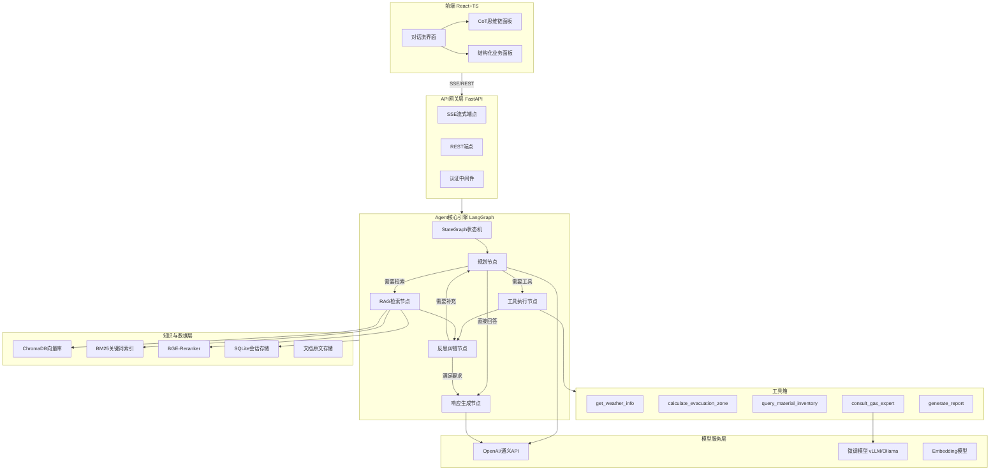

# 燃气抢险智能副驾 (Copilot) — 架构优化与实施计划

---

## 一、架构总体分析与优化建议

### 1.1 原架构优点

- 模块划分清晰：前端 / Agent 引擎 / 知识层三层解耦
- "微调模型作为 Tool"思路正确，让通用大模型做编排、专业模型做专家回答
- CoT 可视化、结构化面板等 UX 设计直击业务痛点
- 技术栈选型主流且轻量（Vite + shadcn/ui、FastAPI、ChromaDB）

### 1.2 需要优化的关键问题

**问题 1：意图路由层冗余**

- 单独写一个 Router 来分类"闲聊 / RAG / Tool Calling"是 LangChain 早期的做法
- **优化：用 LangGraph 的条件边 (conditional edges) 替代手写 Router**。LangGraph 的 StateGraph 天然支持根据 LLM 输出决定下一步走向（调工具 / 检索 / 直接回复），省去了额外的分类模型

**问题 2：RAG 管道太简单**

- 仅做"PDF 切片 + 向量化"容易导致召回质量差（燃气规范文档有大量表格和条款编号）
- **优化：采用混合检索 (Hybrid Search) + Reranker 两阶段**
  - 第一阶段：向量检索 + BM25 关键词检索并行
  - 第二阶段：用 Cross-Encoder Reranker（如 bge-reranker）对结果重排序
  - 切片策略：对规范文档按"章节/条款"切片而非固定 token 数

**问题 3：缺少对话持久化与会话管理**

- 仅有"短期记忆"不足以支撑真实场景（调度员可能中断后回来继续）
- **优化：增加 SQLite/PostgreSQL 存储对话历史**，LangGraph 内置 `checkpointer` 支持会话状态持久化

**问题 4：缺少结构化输出约束**

- 抢险方案、报告等需要固定格式输出
- **优化：使用 Pydantic 模型 + LLM structured output 约束关键节点的输出格式**

**问题 5：前后端通信方案未明确**

- 流式输出需要 SSE（Server-Sent Events）而非普通 REST
- **优化：普通请求走 REST，流式对话走 SSE，前端用 `EventSource` / `fetch` ReadableStream 消费**

**问题 6：缺少错误处理与兜底机制**

- Agent 调用工具失败、LLM 超时等场景未考虑
- **优化：在 LangGraph 中加入 fallback 节点和重试逻辑**

---

## 二、优化后的系统架构



---

## 三、目录结构设计

```
gas-copilot/
├── frontend/                    # 前端
│   ├── src/
│   │   ├── components/
│   │   │   ├── chat/            # 对话相关组件
│   │   │   │   ├── ChatWindow.tsx
│   │   │   │   ├── MessageBubble.tsx
│   │   │   │   ├── StreamingText.tsx
│   │   │   │   └── CoTCollapsible.tsx
│   │   │   ├── panels/          # 业务面板
│   │   │   │   ├── MaterialPanel.tsx
│   │   │   │   └── EvacuationMap.tsx
│   │   │   └── ui/              # shadcn/ui 组件
│   │   ├── stores/              # Zustand 状态
│   │   │   ├── chatStore.ts
│   │   │   └── panelStore.ts
│   │   ├── services/            # API 通信层
│   │   │   ├── api.ts
│   │   │   └── sse.ts
│   │   ├── types/               # TS 类型定义
│   │   └── App.tsx
│   ├── package.json
│   ├── vite.config.ts
│   └── tailwind.config.ts
├── backend/                     # 后端
│   ├── app/
│   │   ├── main.py              # FastAPI 入口
│   │   ├── api/
│   │   │   ├── routes/
│   │   │   │   ├── chat.py      # SSE 流式对话端点
│   │   │   │   ├── history.py   # 对话历史
│   │   │   │   └── health.py
│   │   │   └── deps.py          # 依赖注入
│   │   ├── agent/
│   │   │   ├── graph.py         # LangGraph 核心图定义
│   │   │   ├── nodes.py         # 各节点逻辑
│   │   │   ├── state.py         # Agent 状态定义
│   │   │   └── prompts.py       # Prompt 模板
│   │   ├── tools/
│   │   │   ├── weather.py
│   │   │   ├── evacuation.py
│   │   │   ├── inventory.py
│   │   │   ├── gas_expert.py    # 调用微调模型
│   │   │   └── report.py
│   │   ├── rag/
│   │   │   ├── retriever.py     # 混合检索逻辑
│   │   │   ├── reranker.py
│   │   │   └── ingest.py        # 文档入库脚本
│   │   ├── memory/
│   │   │   ├── checkpointer.py  # LangGraph 会话持久化
│   │   │   └── models.py        # SQLAlchemy 模型
│   │   └── config.py            # 配置管理
│   ├── data/
│   │   └── docs/                # 燃气规范 PDF
│   ├── requirements.txt
│   └── .env.example
├── docker-compose.yml           # 一键启动
└── README.md
```

---

## 四、各模块详细实施方案

### 4.1 后端 Agent 引擎（核心，优先实现）

**Agent 状态定义 (`state.py`)**：使用 TypedDict 定义 LangGraph 状态

```python
from typing import TypedDict, Annotated, Sequence
from langchain_core.messages import BaseMessage
from langgraph.graph.message import add_messages

class AgentState(TypedDict):
    messages: Annotated[Sequence[BaseMessage], add_messages]
    current_plan: str          # 当前执行计划
    tool_results: list[dict]   # 工具调用结果（供前端 CoT 展示）
    retrieved_docs: list[str]  # RAG 检索到的文档
    final_report: str | None   # 结构化报告
```

**LangGraph 核心图 (`graph.py`)**：

```python
from langgraph.graph import StateGraph, END

graph = StateGraph(AgentState)
graph.add_node("planner", planner_node)
graph.add_node("tool_executor", tool_executor_node)
graph.add_node("rag_retriever", rag_retriever_node)
graph.add_node("reflector", reflector_node)
graph.add_node("responder", responder_node)

graph.set_entry_point("planner")
graph.add_conditional_edges("planner", route_decision, {
    "use_tools": "tool_executor",
    "need_rag": "rag_retriever",
    "direct_answer": "responder",
})
graph.add_edge("tool_executor", "reflector")
graph.add_edge("rag_retriever", "reflector")
graph.add_conditional_edges("reflector", check_completeness, {
    "need_more": "planner",
    "sufficient": "responder",
})
graph.add_edge("responder", END)

app = graph.compile(checkpointer=sqlite_checkpointer)
```

关键设计点：

- `planner` 节点由 OpenAI 驱动，负责任务拆解
- `reflector` 节点实现"反思纠错闭环"——检查工具/检索结果是否充分，不充分则回到 planner 重新规划
- `checkpointer` 实现会话断点恢复

### 4.2 工具箱设计

每个工具用 `@tool` 装饰器注册，返回结构化 JSON：

- `get_weather_info(location: str)` — 返回 `{wind_direction, wind_speed, temperature, humidity}`
- `calculate_evacuation_zone(pressure: float, diameter: float, leak_type: str)` — 返回 `{radius_m, affected_area, risk_level}`
- `query_material_inventory(location: str, radius_km: float)` — 返回 `[{station_name, distance, items: [...]}]`
- `consult_gas_expert(query: str)` — 调用本地微调模型，返回专业规范回答
- `generate_report(context: dict)` — 基于所有收集信息生成结构化抢险报告

### 4.3 RAG 混合检索管道

```
用户问题 → Query改写(HyDE) → ┬→ 向量检索 (ChromaDB, top-20)  ─┐
                               └→ BM25检索 (top-20)            ─┤
                                                                 ├→ RRF融合 → Reranker (top-5) → 返回
```

- 使用 `bge-large-zh-v1.5` 做 Embedding（中文效果好）
- 切片策略：按规范条款编号切分，保留章节元数据
- Reranker 使用 `bge-reranker-v2-m3`

### 4.4 前端核心实现

**SSE 流式消费 (`sse.ts`)**：

```typescript
export async function streamChat(
  message: string,
  sessionId: string,
  onToken: (token: string) => void,
  onToolCall: (toolCall: ToolCallEvent) => void,
  onPanelData: (data: PanelData) => void,
) {
  const response = await fetch('/api/chat/stream', {
    method: 'POST',
    headers: { 'Content-Type': 'application/json' },
    body: JSON.stringify({ message, session_id: sessionId }),
  });
  const reader = response.body!.getReader();
  // 解析 SSE 事件，分发到不同回调
}
```

**SSE 事件类型设计**：

- `token` — 流式文本片段
- `tool_start` / `tool_end` — 工具调用开始/结束（驱动 CoT 面板）
- `panel_data` — 结构化数据（驱动业务面板渲染图表/表格）
- `error` — 错误信息
- `done` — 完成信号

**CoT 可视化**：用 `Collapsible` 组件逐步展示 `tool_start/tool_end` 事件流，带时间戳和状态图标

**业务面板**：监听 `panel_data` 事件，根据 `data.type` 字段动态渲染不同组件（表格用 `@tanstack/react-table`，图表用 `recharts`）

### 4.5 可观测性

- 使用 LangSmith 做 Agent 全链路追踪（每次 tool call、LLM 调用、检索都有 trace）
- 在 FastAPI 层加结构化日志（`structlog`），记录请求/响应延迟
- 前端记录用户行为（点击了哪些 CoT 展开、对回答是否满意的反馈按钮）

---

## 五、实施顺序与进度追踪

采用"后端驱动、前后并行"的策略，分 5 个阶段：

### 阶段 1 (Day 1-2)：项目脚手架 + Agent 核心骨架

- [x] **项目脚手架搭建**：前端 Vite+React+TS+shadcn/ui 初始化，后端 FastAPI 项目结构 + 依赖管理
- [x] **LangGraph Agent 核心引擎**：定义 AgentState、构建 StateGraph（planner / tool_executor / rag_retriever / reflector / responder 五节点）+ SQLite checkpointer

### 阶段 2 (Day 3-4)：工具箱 + RAG 管道

- [x] **工具箱实现**：5 个标准化工具（weather / evacuation / inventory / gas_expert / report），其中 gas_expert 对接本地微调模型
- [x] **RAG 混合检索管道**：文档切片入库脚本 + ChromaDB 向量检索 + BM25 + RRF 融合 + BGE-Reranker

### 阶段 3 (Day 3-5, 与阶段 2 并行)：前端 UI

- [x] **FastAPI SSE 流式端点**：实现 `/api/chat/stream`，输出 token / tool_start / tool_end / panel_data / done 五种事件
- [x] **前端对话流 UI**：ChatWindow + MessageBubble + StreamingText + SSE 消费层 + Zustand 状态管理
- [x] **前端 CoT 可视化面板 + 结构化业务面板**（表格 / 图表动态渲染）

### 阶段 4 (Day 5-6)：前后端联调

- [x] **前后端联调**：完整工作流走通（用户输入 → Agent 规划 → 工具调用 → 流式输出 → 面板渲染）

### 阶段 5 (Day 7)：可观测性 + 容器化

- [x] **可观测性接入**：LangSmith 全链路追踪 + structlog 结构化日志
- [x] **Docker 容器化**：docker-compose 一键启动前端 + 后端 + 向量库 + README 文档
