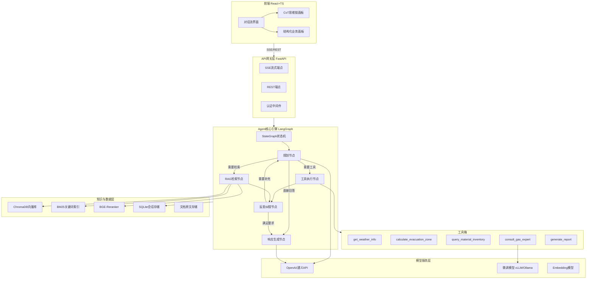

# 燃气抢险智能副驾 (Copilot) — 架构优化与实施计划

---

## 一、架构总体分析与优化建议

### 1.1 原架构优点

- 模块划分清晰：前端 / Agent 引擎 / 知识层三层解耦
- "微调模型作为 Tool"思路正确，让通用大模型做编排、专业模型做专家回答
- CoT 可视化、结构化面板等 UX 设计直击业务痛点
- 技术栈选型主流且轻量（Vite + shadcn/ui、FastAPI、ChromaDB）

### 1.2 需要优化的关键问题

**问题 1：意图路由层冗余**

- 单独写一个 Router 来分类"闲聊 / RAG / Tool Calling"是 LangChain 早期的做法
- **优化：用 LangGraph 的条件边 (conditional edges) 替代手写 Router**。LangGraph 的 StateGraph 天然支持根据 LLM 输出决定下一步走向（调工具 / 检索 / 直接回复），省去了额外的分类模型

**问题 2：RAG 管道太简单**

- 仅做"PDF 切片 + 向量化"容易导致召回质量差（燃气规范文档有大量表格和条款编号）
- **优化：采用混合检索 (Hybrid Search) + Reranker 两阶段**
  - 第一阶段：向量检索 + BM25 关键词检索并行
  - 第二阶段：用 Cross-Encoder Reranker（如 bge-reranker）对结果重排序
  - 切片策略：对规范文档按"章节/条款"切片而非固定 token 数

**问题 3：缺少对话持久化与会话管理**

- 仅有"短期记忆"不足以支撑真实场景（调度员可能中断后回来继续）
- **优化：增加 SQLite/PostgreSQL 存储对话历史**，LangGraph 内置 `checkpointer` 支持会话状态持久化

**问题 4：缺少结构化输出约束**

- 抢险方案、报告等需要固定格式输出
- **优化：使用 Pydantic 模型 + LLM structured output 约束关键节点的输出格式**

**问题 5：前后端通信方案未明确**

- 流式输出需要 SSE（Server-Sent Events）而非普通 REST
- **优化：普通请求走 REST，流式对话走 SSE，前端用 `EventSource` / `fetch` ReadableStream 消费**

**问题 6：缺少错误处理与兜底机制**

- Agent 调用工具失败、LLM 超时等场景未考虑
- **优化：在 LangGraph 中加入 fallback 节点和重试逻辑**

---

## 二、优化后的系统架构


```mermaid
graph TB
    subgraph frontend [前端 React+TS]
        ChatUI[对话流界面]
        CoTPanel[CoT思维链面板]
        BizPanel[结构化业务面板]
        ChatUI --> CoTPanel
        ChatUI --> BizPanel
    end

    subgraph gateway [API网关层 FastAPI]
        SSE[SSE流式端点]
        REST[REST端点]
        AuthMiddleware[认证中间件]
    end

    subgraph agentCore [Agent核心引擎 LangGraph]
        StateGraph[StateGraph状态机]
        Planner[规划节点]
        ToolExec[工具执行节点]
        RAGNode[RAG检索节点]
        Responder[响应生成节点]
        Reflector[反思纠错节点]

        Planner -->|需要工具| ToolExec
        Planner -->|需要检索| RAGNode
        Planner -->|直接回答| Responder
        ToolExec --> Reflector
        RAGNode --> Reflector
        Reflector -->|需要补充| Planner
        Reflector -->|满足要求| Responder
    end

    subgraph tools [工具箱]
        Weather[get_weather_info]
        Evacuation[calculate_evacuation_zone]
        Inventory[query_material_inventory]
        Expert[consult_gas_expert]
        ReportGen[generate_report]
    end

    subgraph knowledge [知识与数据层]
        VectorDB[ChromaDB向量库]
        BM25Index[BM25关键词索引]
        Reranker[BGE-Reranker]
        SQLite[SQLite会话存储]
        DocStore[文档原文存储]
    end

    subgraph models [模型服务层]
        OpenAI[OpenAI/通义API]
        FineTuned[微调模型 vLLM/Ollama]
        EmbedModel[Embedding模型]
    end

    frontend -->|SSE/REST| gateway
    gateway --> agentCore
    StateGraph --> Planner
    ToolExec --> tools
    RAGNode --> VectorDB
    RAGNode --> BM25Index
    RAGNode --> Reranker
    Expert --> FineTuned
    Planner --> OpenAI
    Responder --> OpenAI
    agentCore --> SQLite
```

---

## 三、目录结构设计

```
gas-copilot/
├── frontend/                    # 前端
│   ├── src/
│   │   ├── components/
│   │   │   ├── chat/            # 对话相关组件
│   │   │   │   ├── ChatWindow.tsx
│   │   │   │   ├── MessageBubble.tsx
│   │   │   │   ├── StreamingText.tsx
│   │   │   │   └── CoTCollapsible.tsx
│   │   │   ├── panels/          # 业务面板
│   │   │   │   ├── MaterialPanel.tsx
│   │   │   │   └── EvacuationMap.tsx
│   │   │   └── ui/              # shadcn/ui 组件
│   │   ├── stores/              # Zustand 状态
│   │   │   ├── chatStore.ts
│   │   │   └── panelStore.ts
│   │   ├── services/            # API 通信层
│   │   │   ├── api.ts
│   │   │   └── sse.ts
│   │   ├── types/               # TS 类型定义
│   │   └── App.tsx
│   ├── package.json
│   ├── vite.config.ts
│   └── tailwind.config.ts
├── backend/                     # 后端
│   ├── app/
│   │   ├── main.py              # FastAPI 入口
│   │   ├── api/
│   │   │   ├── routes/
│   │   │   │   ├── chat.py      # SSE 流式对话端点
│   │   │   │   ├── history.py   # 对话历史
│   │   │   │   └── health.py
│   │   │   └── deps.py          # 依赖注入
│   │   ├── agent/
│   │   │   ├── graph.py         # LangGraph 核心图定义
│   │   │   ├── nodes.py         # 各节点逻辑
│   │   │   ├── state.py         # Agent 状态定义
│   │   │   └── prompts.py       # Prompt 模板
│   │   ├── tools/
│   │   │   ├── weather.py
│   │   │   ├── evacuation.py
│   │   │   ├── inventory.py
│   │   │   ├── gas_expert.py    # 调用微调模型
│   │   │   └── report.py
│   │   ├── rag/
│   │   │   ├── retriever.py     # 混合检索逻辑
│   │   │   ├── reranker.py
│   │   │   └── ingest.py        # 文档入库脚本
│   │   ├── memory/
│   │   │   ├── checkpointer.py  # LangGraph 会话持久化
│   │   │   └── models.py        # SQLAlchemy 模型
│   │   └── config.py            # 配置管理
│   ├── data/
│   │   └── docs/                # 燃气规范 PDF
│   ├── requirements.txt
│   └── .env.example
├── docker-compose.yml           # 一键启动
└── README.md
```

---

## 四、各模块详细实施方案

### 4.1 后端 Agent 引擎（核心，优先实现）

**Agent 状态定义 (`state.py`)**：使用 TypedDict 定义 LangGraph 状态

```python
from typing import TypedDict, Annotated, Sequence
from langchain_core.messages import BaseMessage
from langgraph.graph.message import add_messages

class AgentState(TypedDict):
    messages: Annotated[Sequence[BaseMessage], add_messages]
    current_plan: str          # 当前执行计划
    tool_results: list[dict]   # 工具调用结果（供前端 CoT 展示）
    retrieved_docs: list[str]  # RAG 检索到的文档
    final_report: str | None   # 结构化报告
```

**LangGraph 核心图 (`graph.py`)**：

```python
from langgraph.graph import StateGraph, END

graph = StateGraph(AgentState)
graph.add_node("planner", planner_node)
graph.add_node("tool_executor", tool_executor_node)
graph.add_node("rag_retriever", rag_retriever_node)
graph.add_node("reflector", reflector_node)
graph.add_node("responder", responder_node)

graph.set_entry_point("planner")
graph.add_conditional_edges("planner", route_decision, {
    "use_tools": "tool_executor",
    "need_rag": "rag_retriever",
    "direct_answer": "responder",
})
graph.add_edge("tool_executor", "reflector")
graph.add_edge("rag_retriever", "reflector")
graph.add_conditional_edges("reflector", check_completeness, {
    "need_more": "planner",
    "sufficient": "responder",
})
graph.add_edge("responder", END)

app = graph.compile(checkpointer=sqlite_checkpointer)
```

关键设计点：

- `planner` 节点由 OpenAI 驱动，负责任务拆解
- `reflector` 节点实现"反思纠错闭环"——检查工具/检索结果是否充分，不充分则回到 planner 重新规划
- `checkpointer` 实现会话断点恢复

### 4.2 工具箱设计

每个工具用 `@tool` 装饰器注册，返回结构化 JSON：

- `get_weather_info(location: str)` — 返回 `{wind_direction, wind_speed, temperature, humidity}`
- `calculate_evacuation_zone(pressure: float, diameter: float, leak_type: str)` — 返回 `{radius_m, affected_area, risk_level}`
- `query_material_inventory(location: str, radius_km: float)` — 返回 `[{station_name, distance, items: [...]}]`
- `consult_gas_expert(query: str)` — 调用本地微调模型，返回专业规范回答
- `generate_report(context: dict)` — 基于所有收集信息生成结构化抢险报告

### 4.3 RAG 混合检索管道

```
用户问题 → Query改写(HyDE) → ┬→ 向量检索 (ChromaDB, top-20)  ─┐
                               └→ BM25检索 (top-20)            ─┤
                                                                 ├→ RRF融合 → Reranker (top-5) → 返回
```

- 使用 `bge-large-zh-v1.5` 做 Embedding（中文效果好）
- 切片策略：按规范条款编号切分，保留章节元数据
- Reranker 使用 `bge-reranker-v2-m3`

### 4.4 前端核心实现

**SSE 流式消费 (`sse.ts`)**：

```typescript
export async function streamChat(
  message: string,
  sessionId: string,
  onToken: (token: string) => void,
  onToolCall: (toolCall: ToolCallEvent) => void,
  onPanelData: (data: PanelData) => void,
) {
  const response = await fetch('/api/chat/stream', {
    method: 'POST',
    headers: { 'Content-Type': 'application/json' },
    body: JSON.stringify({ message, session_id: sessionId }),
  });
  const reader = response.body!.getReader();
  // 解析 SSE 事件，分发到不同回调
}
```

**SSE 事件类型设计**：

- `token` — 流式文本片段
- `tool_start` / `tool_end` — 工具调用开始/结束（驱动 CoT 面板）
- `panel_data` — 结构化数据（驱动业务面板渲染图表/表格）
- `error` — 错误信息
- `done` — 完成信号

**CoT 可视化**：用 `Collapsible` 组件逐步展示 `tool_start/tool_end` 事件流，带时间戳和状态图标

**业务面板**：监听 `panel_data` 事件，根据 `data.type` 字段动态渲染不同组件（表格用 `@tanstack/react-table`，图表用 `recharts`）

### 4.5 可观测性

- 使用 LangSmith 做 Agent 全链路追踪（每次 tool call、LLM 调用、检索都有 trace）
- 在 FastAPI 层加结构化日志（`structlog`），记录请求/响应延迟
- 前端记录用户行为（点击了哪些 CoT 展开、对回答是否满意的反馈按钮）

---

## 五、实施顺序与进度追踪

采用"后端驱动、前后并行"的策略，分 5 个阶段：

### 阶段 1 (Day 1-2)：项目脚手架 + Agent 核心骨架

- [x] **项目脚手架搭建**：前端 Vite+React+TS+shadcn/ui 初始化，后端 FastAPI 项目结构 + 依赖管理
- [x] **LangGraph Agent 核心引擎**：定义 AgentState、构建 StateGraph（planner / tool_executor / rag_retriever / reflector / responder 五节点）+ SQLite checkpointer

### 阶段 2 (Day 3-4)：工具箱 + RAG 管道

- [x] **工具箱实现**：5 个标准化工具（weather / evacuation / inventory / gas_expert / report），其中 gas_expert 对接本地微调模型
- [x] **RAG 混合检索管道**：文档切片入库脚本 + ChromaDB 向量检索 + BM25 + RRF 融合 + BGE-Reranker

### 阶段 3 (Day 3-5, 与阶段 2 并行)：前端 UI

- [x] **FastAPI SSE 流式端点**：实现 `/api/chat/stream`，输出 token / tool_start / tool_end / panel_data / done 五种事件
- [x] **前端对话流 UI**：ChatWindow + MessageBubble + StreamingText + SSE 消费层 + Zustand 状态管理
- [x] **前端 CoT 可视化面板 + 结构化业务面板**（表格 / 图表动态渲染）

### 阶段 4 (Day 5-6)：前后端联调

- [x] **前后端联调**：完整工作流走通（用户输入 → Agent 规划 → 工具调用 → 流式输出 → 面板渲染）

### 阶段 5 (Day 7)：可观测性 + 容器化

- [x] **可观测性接入**：LangSmith 全链路追踪 + structlog 结构化日志
- [x] **Docker 容器化**：docker-compose 一键启动前端 + 后端 + 向量库 + README 文档

---

## 六、演进路线（Phase 6+）：从"会话副驾"到"事件驱动的拓扑感知 Agent"

### 6.0 背景与目标

现有系统是在"已有 Web 地图 + 管线点选 + 关阀算法 + 扩散范围 + 方案生成"之上衍生出的**对话副驾**。当前形态有两个根本局限：

1. **被动驱动** — 必须由调度员主动在对话框发起，失效上报本身不会触发 agent
2. **上下文割裂** — agent 不感知管网拓扑、阀门实时状态、地图上已有的事件/疏散圈，关阀与扩散计算由前端独立执行，agent 无法闭环参与

演进目标：

- **拓扑感知**：把管网拓扑作为 agent 的一等知识结构，关阀/扩散/波及分析由 agent 按需编排
- **事件驱动**：地图端的失效上报直接开启 agent 会话，而不是等用户敲键盘
- **Skill 化**：把"关阀方案生成 / 扩散范围生成 / 抢修方案生成"三条确定性流程抽象为 LangGraph 子图（Skill），与自由决策的主 agent 解耦
- **HITL 半自主**：关键动作（下发关阀指令、派单、对外通知）在 Skill 内部设检查点，一键审批后执行
- **长期记忆**：历史事故、复盘、规范条款形成三层记忆，相似事故自动召回参考

---

---

### 6.0.5 数据资产盘点与规整（Phase 6 前置，**先做**）

#### 现有资产

| 文件 | 体量 | 形态 | 价值 |
|---|---|---|---|
| `*.xlsx` | 600+ 条 | 按字段结构化（事件类型/管材/压力/失效模式/处置资源…） | **案例库种子 + Skill 输出 schema 依据**（金矿） |
| `*.jsonl` | 600+ 条 | `{question, think, answer}` 三元组 | **gas_expert 微调语料 + RAG few-shot**（think 字段是显式 CoT，尤其珍贵） |

#### 目录落位（**请把文件复制到这里**）

```
backend/data/cases/
├── raw/                            # 原始文件（保留，只读）
│   ├── incidents.xlsx              # ← 把 xlsx 放这里
│   └── incidents.jsonl             # ← 把 jsonl 放这里
├── processed/                      # 规整后的产物（脚本生成，可重建）
│   ├── cases.parquet               # 结构化案例（反解 xlsx）
│   ├── cases.embedding.npy         # 向量化摘要
│   ├── train.jsonl                 # 微调训练集 (≈70%)
│   ├── val.jsonl                   # 微调验证集 (≈15%)
│   ├── regression.jsonl            # 回归测试集 (≈15%)
│   └── few_shot_pool.jsonl         # planner few-shot 候选池
└── schemas/
    └── case_schema.py              # IncidentCase Pydantic 定义
```

目录已在 `backend/data/cases/{raw,processed}/` 预创建。两份文件任意文件名均可，建议统一为 `incidents.xlsx` / `incidents.jsonl`。

#### 任务清单

- [x] 6.0.5.1 **xlsx schema 反解脚本** `scripts/parse_incidents_xlsx.py`
  - 读取 xlsx → 按表头字段映射到 `IncidentCase` Pydantic 模型
  - 枚举值规整（"低压/中压/高压"、"DN25/DN50"、"一级/二级/三级"）
  - 单位统一（埋深 m、压力 MPa、管径 mm）
  - 产出 `processed/cases.parquet`
- [x] 6.0.5.2 **数据质检**
  - 字段完整度统计（每个字段非空率、枚举值分布）
  - 异常值：埋深 < 0 / 压力越界 / 管径非标
  - 输出 `processed/data_quality_report.md`
- [x] 6.0.5.3 **分层抽样**
  - 按 `(失效模式, 压力级制)` 分层，7:1.5:1.5 切分 train/val/regression
  - 回归集必须覆盖每个失效模式至少 1 条
  - few-shot 池：人工挑选 10-15 条高质量案例（推理链完整、答案规范）
- [x] 6.0.5.4 **jsonl ↔ xlsx 关联**
  - 每条 case 保留原始 jsonl 的 `think` 字段 → `IncidentCase.think_trace`
  - 生成向量化摘要（把关键字段 + answer 摘要一起 embed），写入 `cases.embedding.npy`
- [x] 6.0.5.5 **脱敏**
  - 位置模糊化：坐标栅格化到 100m（如 xlsx 含经纬度）
  - PII 清洗：人名/单位名/电话 → 占位符
  - 脱敏规则写入 `scripts/pii_redact.py`，可重跑
- [x] 6.0.5.6 **冷启动导入 hooks**（Phase 9 依赖，先只生成产物，暂不入库）

#### 数据资产的下游用途映射

| 用途 | 消费者 | 用哪份 | 阶段 |
|---|---|---|---|
| `IncidentCase` schema 设计依据 | Phase 6.1.5 `repair_plan` Skill | xlsx 字段 | 立刻 |
| Skill 回归测试集 | Phase 6.1 全部 Skill 单测 | regression.jsonl | Phase 6 中 |
| 案例库冷启动 | Phase 9 L2 记忆 | cases.parquet + embedding | Phase 9 |
| `gas_expert` 模型微调 | 独立支线 | train/val.jsonl | 并行 |
| planner few-shot | 主 agent prompt | few_shot_pool.jsonl | Phase 6 中后期 |

---

### 6.1 Skill 化重构（核心，Phase 6 先做）

#### 分层边界

| 层级 | 粒度 | 本阶段对应 |
|---|---|---|
| Tool（原子） | 单次调用、无状态 | `get_weather_info` / `query_pipeline_topology` / `query_valve_status` |
| **Skill（复合工作流）** | 确定性 DAG、有内部状态、含 HITL 检查点 | `valve_isolation` / `diffusion_zone` / `repair_plan` |
| Agent（编排） | LLM 自由决策，决定调哪些 skill、什么顺序 | 主 StateGraph |

**关键判据**：
- 步骤固定、算法确定 → Skill（子图）
- 需要 LLM 判断/改写 → Agent 节点
- 一次查询/计算 → Tool

#### 目录结构新增

```
backend/app/
├── skills/                         # 新增：复合工作流
│   ├── __init__.py                 # Skill 注册表（对 agent 暴露统一接口）
│   ├── base.py                     # SkillState 基类 + HITL checkpoint 抽象
│   ├── valve_isolation/
│   │   ├── graph.py                # 子图定义
│   │   ├── nodes.py                # 校验/最小割/可操作性/排序/预览/审批
│   │   └── state.py
│   ├── diffusion_zone/
│   │   ├── graph.py
│   │   ├── nodes.py                # 气象拉取/烟羽模型/GIS叠加/分级
│   │   └── state.py
│   └── repair_plan/
│       ├── graph.py
│       ├── nodes.py                # 材料核对/人员调度/时序/产出
│       └── state.py
├── topology/                       # 新增：管网拓扑域模型
│   ├── graph_store.py              # 拓扑加载/查询（NetworkX 起步，后续可换 Neo4j）
│   ├── min_cut.py                  # 最小割阀门隔离算法
│   └── schema.py                   # Pipeline/Valve/Node Pydantic 模型
```

#### 三个核心 Skill 规格

**Skill A：`valve_isolation`（关阀方案生成）**

输入：`{leak_point_id, pipeline_id, severity, leak_params}`

DAG：
```
校验输入 → 加载拓扑子图 → 最小割算法求阀门集
        → 阀门可操作性检查（维护/远控/手动）→ 执行顺序排序（优先级+安全时序）
        → [HITL 检查点] 方案预览回写地图 → 调度员审批
        → (通过) SCADA 下发指令 / (驳回) 附原因回到规划
```

产出：`{valve_sequence: [...], affected_users: N, estimated_time_min, risk_notes}`

**Skill B：`diffusion_zone`（扩散范围生成）**

输入：`{leak_point, pressure, diameter, leak_type, timestamp}`

DAG：
```
拉取实时气象 → 选择扩散模型（高斯烟羽/爆炸当量）
           → 叠加 GIS（人口密度、学校医院、地下空间）
           → 分级疏散圈（红/橙/黄）→ 渲染 GeoJSON → 回写地图图层
```

产出：`{zones: [{level, polygon, population, critical_facilities}], model_used, confidence}`

**Skill C：`repair_plan`（抢修方案起草）**

现有 `generate_report` 升级为多步：
```
汇总现场 + valve_isolation 产出 + diffusion_zone 产出
  → 材料核对（调 inventory tool）→ 人员/装备调度
  → 时序编排（Gantt 化）→ 规范引用（调 RAG）
  → 结构化输出（Pydantic）→ [HITL] 调度员确认 → 下发工单
```

#### Skill 对 Agent 的暴露方式

Skill 对外注册为一个"虚拟 tool"，agent planner 看到的描述是输入/输出契约；真正执行时路由到子图。保持主 agent 的 prompt 简洁：

```python
@register_skill
class ValveIsolationSkill(Skill):
    name = "valve_isolation"
    description = "给定泄漏点，生成关阀方案（含阀门序列与审批预览）"
    input_schema = ValveIsolationInput
    output_schema = ValveIsolationOutput
    graph = valve_isolation_graph  # LangGraph 子图
```

#### 任务清单

- [x] 6.1.1 定义 `Skill` 抽象基类与注册表；打通"主 agent 调用 skill 子图"的路径（子图共享 checkpointer + 独立 state）
- [x] 6.1.2 `topology/` 模块：Pipeline/Valve Pydantic 模型 + NetworkX 拓扑加载器 + 最小割算法（从现有 Web 系统迁移或重新实现，接口对齐）
- [x] 6.1.3 实现 `valve_isolation` Skill：6 个节点 + HITL 检查点；mock SCADA 下发
- [x] 6.1.4 实现 `diffusion_zone` Skill：集成现有扩散算法为内部节点；产出 GeoJSON
- [x] 6.1.5 把 `generate_report` tool 重构为 `repair_plan` Skill，消费前两个 Skill 的产出
- [x] 6.1.6 主 agent planner prompt 更新：把 3 个 skill 以虚拟 tool 形式暴露；下掉老的 evacuation/report tool
- [x] 6.1.7 Skill 单元测试：给定输入 → 确定性输出（不依赖 LLM）

---

### 6.2 拓扑感知与地图深度集成（Phase 7）

#### 与现有 Web 系统的契约

需要对方暴露（或我方定义后对方实现）：

| 接口 | 协议 | 方向 | 用途 |
|---|---|---|---|
| `GET /api/topology/subgraph?center=&radius=` | REST | Web → Copilot | 拉取事故点周边拓扑子图 |
| `GET /api/valves/status?ids=[]` | REST | Web → Copilot | 查询阀门实时状态/可操作性 |
| `POST /api/incidents/webhook` | Webhook | Web → Copilot | **失效上报事件推送**（Phase 8 依赖） |
| `POST /api/map/overlay` | REST | Copilot → Web | 把关阀预览 / 扩散圈 GeoJSON 写回地图图层 |
| `WS /api/events` | WebSocket | Web ↔ Copilot | 调度员审批结果、阀门状态变化实时同步 |

前期若对方未就绪，本地用 Mock Server（FastAPI 起一个 `mock_web/` 子服务）替代。

#### 任务清单

- [x] 6.2.1 在 `backend/app/integrations/web_map/` 建 client + mock server
- [x] 6.2.2 拓扑缓存策略：LRU + TTL，避免每次调 skill 都远程拉
- [x] 6.2.3 地图回写 client：`push_overlay(session_id, geojson, layer_type)`；前端对应新增图层管理
- [x] 6.2.4 前端面板新增"地图同步状态"指示器（同步中/已同步/失败）

---

### 6.3 事件驱动入口（Phase 8）

#### 变更

现在：用户在 ChatInput 键入 → agent 起 session。
目标：**地图失效上报 → webhook → Copilot 自动起 session → 推送到前端对话流**（调度员进入页面已看到 agent 正在处置）。

#### 流程

```
地图点击管线上报
    ↓ POST /api/incidents/webhook (含泄漏参数 + 现场 ID)
Copilot 接收 → 创建 incident_session（SQLite 新表）
    ↓ 触发主 agent，自动 prime messages = [“收到事故上报 X，开始初步研判”]
agent 调度 Skill: diffusion_zone → valve_isolation → repair_plan
    ↓ SSE 推送到订阅该 incident 的所有前端客户端
调度员打开页面 / 手机端 → 看到 CoT 已推进数步 → 介入审批关键节点
```

#### 任务清单

- [ ] 6.3.1 新增 `incidents` 表：`incident_id / session_id / source / status / created_at / payload`
- [ ] 6.3.2 Webhook 端点 + 幂等保护（同 incident 重复上报不重复起 session）
- [ ] 6.3.3 SSE 订阅按 `incident_id` 广播（多终端同步看一个事故）
- [ ] 6.3.4 前端事故列表 / 未读提醒（WebSocket 推送事故创建事件）
- [ ] 6.3.5 Timeout / 失联保护：agent 若卡在某个 HITL 超过 N 分钟，自动升级告警

---

### 6.4 长期记忆与案例库（Phase 9）

#### 三层记忆架构

| 层 | 内容 | 存储 | 召回时机 |
|---|---|---|---|
| L1 规范记忆 | 国标/地标/操作规程 | ChromaDB（现有） | RAG 节点，按查询召回 |
| **L2 案例记忆** | 历史事故 + 处置方案 + 复盘 | ChromaDB + 结构化 Postgres | 事故开局时按相似度召回 top-3，注入 planner |
| L3 用户记忆 | 调度员偏好（方案风格、审批习惯） | SQLite | session 启动时注入 |

#### 案例结构化 schema

```python
class IncidentCase(BaseModel):
    incident_id: str
    occurred_at: datetime
    location: GeoPoint
    pipeline_class: str          # 低压/中压/高压
    leak_type: str
    severity: str
    valve_isolation_result: dict
    diffusion_result: dict
    repair_timeline: list[dict]
    outcome: str                  # 成功处置 / 次生事故 / 误判
    lessons_learned: str         # 复盘文本
    embedding: list[float]       # 向量化摘要
```

#### 新节点：`case_recall_node`

挂在 planner 之前作为可选节点，事故上报时自动触发：

```
incident_webhook → case_recall_node（召回 top-3 相似案例）→ planner（带案例做决策）
```

召回 key：`pipeline_class + leak_type + severity + 地理聚类`。

#### 复盘自动入库

事故关闭时触发 `post_mortem_node`：
- 汇总 skill 产出 + 调度员审批轨迹 + 最终处置结果
- 让 LLM 生成 `lessons_learned` 草稿，调度员编辑后确认入库
- 写入 case store + 更新 embedding

#### 任务清单

- [ ] 6.4.1 `memory/case_store.py` + Postgres 表 + Chroma 案例 collection
- [ ] 6.4.2 `case_recall_node`：按复合 key 召回，top-k 注入 planner prompt
- [ ] 6.4.3 `post_mortem_node`：事故关闭钩子 + 草稿编辑 UI
- [ ] 6.4.4 前端事故详情页：侧边栏展示"相似历史事故"卡片
- [ ] 6.4.5 案例脱敏：位置模糊化（栅格化到 100m）+ 人名/单位名 PII 清洗
- [ ] 6.4.6 初始数据：接入已有历史抢修记录（如有）做冷启动

---

### 6.5 半自主与 HITL 边界（贯穿 Phase 6-9）

固定授权矩阵（写入 `config/authorization.yaml`，不由 LLM 决定）：

| 动作 | 权限 | 是否需要审批 |
|---|---|---|
| 查询类（拓扑/气象/库存/案例） | Agent 自动 | 否 |
| 计算类（扩散/最小割/方案起草） | Agent 自动 | 否 |
| **地图图层回写（预览）** | Agent 自动 | 否（标记为"预览"） |
| **SCADA 关阀指令下发** | HITL | 是（一键审批） |
| **工单派发到人** | HITL | 是（一键审批） |
| **对外通知（消防/居民短信）** | HITL | 是（需二次确认） |
| 案例入库 | HITL | 是（调度员编辑后确认） |

所有 HITL 检查点在 Skill 内部用统一的 `await_approval(approval_type, payload)` 调用实现，前端对应统一的审批卡片 UI。

---

### 6.6 实施顺序与里程碑

| 阶段 | 里程碑 | 验收标准 |
|---|---|---|
| **Phase 6** Skill 化重构 | 三个 Skill 跑通 + 主 agent 切换为 skill 调用 | 关阀方案 / 扩散 / 抢修方案均由 skill 产出，单测覆盖核心路径 |
| **Phase 7** 拓扑感知 | Web 集成契约定义 + Mock 打通 + 真实接口联调 | 对话中 agent 能说出"周边 3 个阀门，X 状态可操作"等拓扑事实 |
| **Phase 8** 事件驱动 | Webhook 起 session + 多终端 SSE 同步 | 地图点击上报 → 前端自动弹出 agent 处置窗口 |
| **Phase 9** 案例库 | 相似案例召回 + 复盘入库 | 相似事故上报时 planner prompt 含 top-3 案例 |

**建议先做 Phase 6**（与现状耦合最强、收益最直接），Phase 7-9 按 Web 端联调节奏并行推进。
